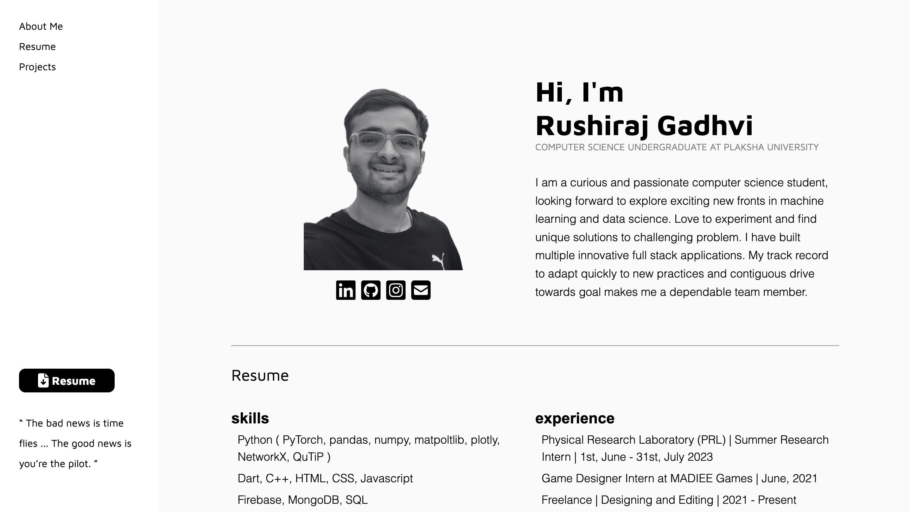
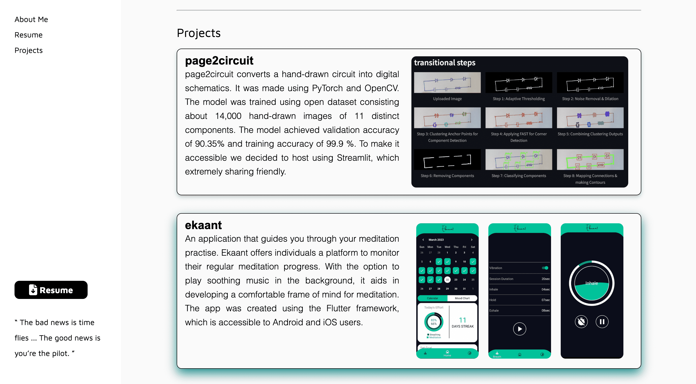

# PortfolioME 🔮: minimalist design

## 🔗 [Demo Link](https://gadhvirushiraj.github.io/portfolioME/)




PortfolioME houses a minimalistic one-page portfolio designed to showcase your work, skills, and experiences in a straightforward and efficient manner. With a focus on simplicity and elegance (grayscale and single accent color), the portfolio is made with barebone HTML and CSS. It remains responsive across mobile, tablets and large screens.

## How To Use 🏁

1. Fork this repoistory and clone it to your local machine.

```bash
$ git clone https://github.com/gadhvirushiraj/portfolioME.git
```

2. Go into the repository

```bash
$ cd portfolioME
```

## Show your support

Give a ⭐️ if this project helped you! Your PRs are also very welcomed yo the project.